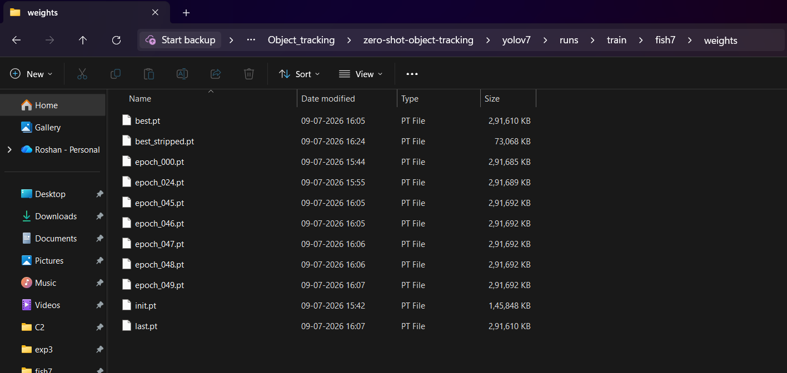

## Trained Model Weights

The custom YOLOv7 model was successfully trained on the **Aquarium Dataset** for **50 epochs**. The training generated the following checkpoint files:

- `best.pt`
- `best_stripped.pt`
- `last.pt`
- Intermediate checkpoints (`epoch_000.pt` to `epoch_049.pt`)

> **Note:** The trained weight files are **not included** in this repository because they exceed GitHub's upload size limit. The `best.pt` and `last.pt` files are approximately **292 MB** each.

The screenshot below shows the generated model weight files after successful training.

